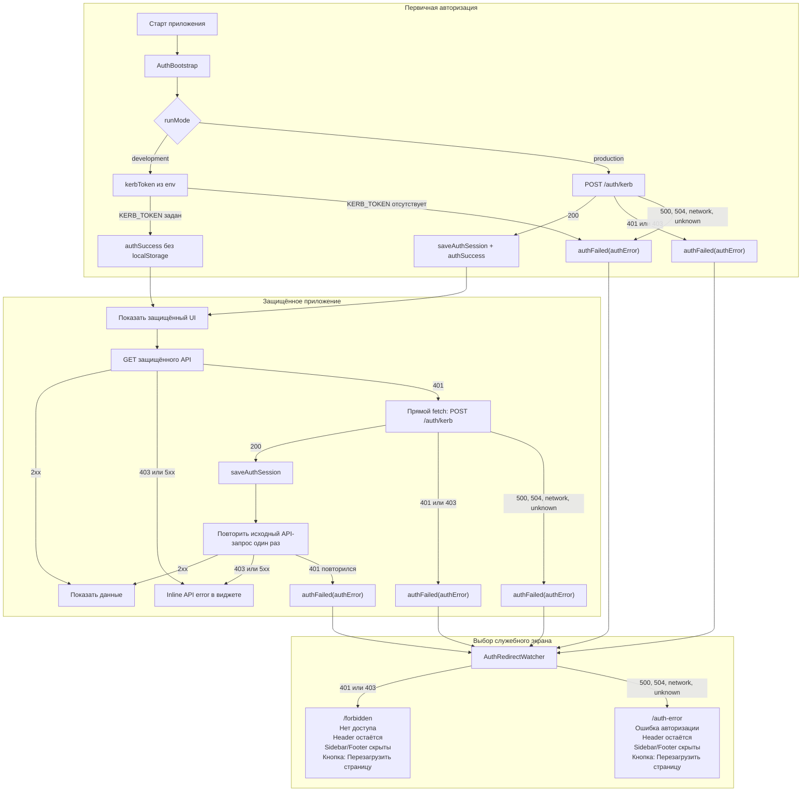

# Auth Flow

Документ описывает клиентский поток авторизации, переходы на страницы статусов и обработку ошибок авторизации.

## Основные участники

- `features/auth/AuthBootstrap` запускает первичную проверку авторизации при старте приложения.
- `features/auth/useAuthBootstrap` выбирает способ первичной авторизации по `runMode`: в `development` использует `kerbToken` из env, в `production` вызывает `POST /auth/kerb`.
- `shared/auth/authSlice` хранит состояние авторизации: пользователь, флаги инициализации и `authError`.
- `features/auth/AuthContentGate` не даёт защищённому UI смонтироваться, пока авторизация не завершена или пользователь не допущен.
- `features/auth/AuthRedirectWatcher` переводит пользователя на нужный служебный экран.
- `shared/api/createAuthBaseQuery` добавляет bearer token из Redux state в API-запросы и выполняет повторную Kerberos-авторизацию после `401` от защищённого API.

## Расположение по FSD

Авторизация разделена на инфраструктуру и пользовательский сценарий.

- `src/shared/auth` — инфраструктура auth-сессии: RTK Query endpoint `POST /auth/kerb`, token/session helpers, Redux slice, selectors и auth-типы.
- `src/shared/api` — общий API-клиент приложения: `mainApi`, `createAuthBaseQuery`, API routes и RTK Query tag types.
- `src/shared/constants/general.ts` — app-wide runtime constants: `kerbToken` и derived run mode flags.
- `src/features/auth` — сценарий авторизации в UI: bootstrap при старте, gate защищённого контента, redirect watcher и служебный auth error UI.
- `src/app/store.ts` — композиция Redux store: подключает `shared/auth` и `shared/api`.

Auth не находится в `entities`, потому что сейчас это не самостоятельная бизнес-сущность пользователя, а инфраструктура токена, минимальной сессии и проверки доступа. Если в приложении появится полноценная модель пользователя, которая используется вне авторизации, её стоит выделять отдельно от token/session flow.

## Первичная авторизация

При загрузке приложения `AuthBootstrap` выбирает flow по `runMode`.

В `development` режиме:

- `/auth/kerb` не вызывается;
- токен берётся из `kerbToken`, который пробрасывается через `nextConfig.env` из `KERB_TOKEN`;
- токен не сохраняется в `localStorage`;
- пользователь записывается в Redux как development session, приложение считается авторизованным;
- `createAuthBaseQuery` берёт токен из Redux state и ставит его в `Authorization` для остальных API-запросов.

Если `RUN_MODE=development`, но `KERB_TOKEN` не задан, bootstrap завершается auth error, чтобы не запускать production-авторизацию случайно.

В `production` режиме `AuthBootstrap` вызывает `POST /auth/kerb`.

Если ответ успешный, токен сохраняется в `localStorage`, пользователь записывается в Redux, приложение считается авторизованным и защищённый UI отображается.

Если ответ неуспешный, ошибка нормализуется через `shared/errors`, сессия очищается, а `AuthRedirectWatcher` выбирает служебный экран:

| Статус `/auth/kerb` | Экран             | Смысл                                                         |
| ------------------- | ----------------- | ------------------------------------------------------------- |
| `200`               | исходная страница | Авторизация прошла                                            |
| `401`               | `/forbidden`      | Пользователь не авторизован или Kerberos не подтвердил сессию |
| `403`               | `/forbidden`      | Пользователь известен, но нет доступа                         |
| `500`, `504`        | `/auth-error`     | Ошибка сервера авторизации                                    |
| network / unknown   | `/auth-error`     | Не удалось проверить доступ                                   |

## Повторная авторизация после API 401

Для обычных API-запросов используется `shared/api/createAuthBaseQuery`.

Если защищённый API возвращает `401` в `production` режиме, фронт пробует заново вызвать `POST /auth/kerb`.

В `development` режиме повторная авторизация не выполняется. Если защищённый API вернул `401`, это означает, что `KERB_TOKEN` не принят backend'ом или устарел. Фронт сохраняет ошибку авторизации и переводит пользователя на служебный экран.

- Повторная авторизация выполняется напрямую через `fetch`, а не через `mainApi` и не через `createAuthBaseQuery`.
- Если несколько API-запросов одновременно получили `401`, они используют один общий `authResultPromise`, а не запускают несколько параллельных `/auth/kerb`.
- Если повторная авторизация успешна, новый токен сохраняется, исходный API-запрос выполняется повторно ровно один раз.
- Если повторный исходный API-запрос снова возвращает `401`, фронт больше не вызывает `/auth/kerb`, очищает сессию и завершает запрос ошибкой.
- Если повторная авторизация возвращает `401` или `403`, пользователь переводится на `/forbidden`.
- Если повторная авторизация возвращает `500`, `504` или сетевую ошибку, пользователь переводится на `/auth-error`.

Такой поток не образует циклическую зависимость: `mainApi` может привести к прямому `fetch /auth/kerb`, но `fetch /auth/kerb` не вызывает `mainApi` обратно. Повтор исходного API-запроса ограничен одной попыткой, поэтому даже неконсистентный backend-контракт не запускает бесконечный цикл переавторизации.

`createAuthBaseQuery` напрямую использует helpers из `shared/auth`, поэтому отдельная handler-прослойка не нужна: `shared/api` и `shared/auth` находятся на одном слое и остаются инфраструктурой без зависимости от `entities`.

`403` от обычного API не запускает повторную авторизацию. Такой ответ считается ошибкой конкретного запроса.

## Блокировка защищённого UI

`AuthContentGate` блокирует рендер защищённого содержимого в двух случаях:

- авторизация ещё не завершена;
- авторизация завершена неуспешно, пользователь не на `/forbidden` или `/auth-error`.

Это важно: если первичный `/auth/kerb` вернул ошибку, обычные страницы не должны монтироваться и запускать свои `GET`-запросы.

## Служебные страницы

`/forbidden` используется только для ошибок доступа: `401` и `403`.

`/auth-error` используется для ошибок проверки авторизации, которые не означают запрет доступа: `500`, `504`, network и unknown.

Обе страницы:

- отображаются без сайдбара и футера;
- сохраняют основной header;
- содержат кнопку `Перезагрузить страницу`;
- могут перенаправлять друг в друга, если после обновления статус ошибки изменился.

Если редирект был сделан с главной страницы `/`, параметр `from` не добавляется.

## Блок-схема

Визуально поток делится на три зоны:

- `Первичная авторизация` решает, можно ли вообще показать защищённое приложение.
- `Защищённое приложение` описывает обычные API-запросы и одноразовый retry после `401`.
- `Выбор служебного экрана` показывает только финальные статусные экраны, а не продолжение бизнес-сценария.

## Правило для разработчиков

- Ошибки авторизации и доступа (`401`, `403`) ведут на `/forbidden`.
- Ошибки проверки авторизации, не связанные с правами (`500`, `504`, network, unknown), ведут на `/auth-error`.
- Ошибки обычных `GET`-запросов отображаются inline в том блоке, данные которого не загрузились.
- Ошибки `POST`, `PUT`, `PATCH`, `DELETE` показываются как обратная связь на действие пользователя, обычно через `message.error`.
