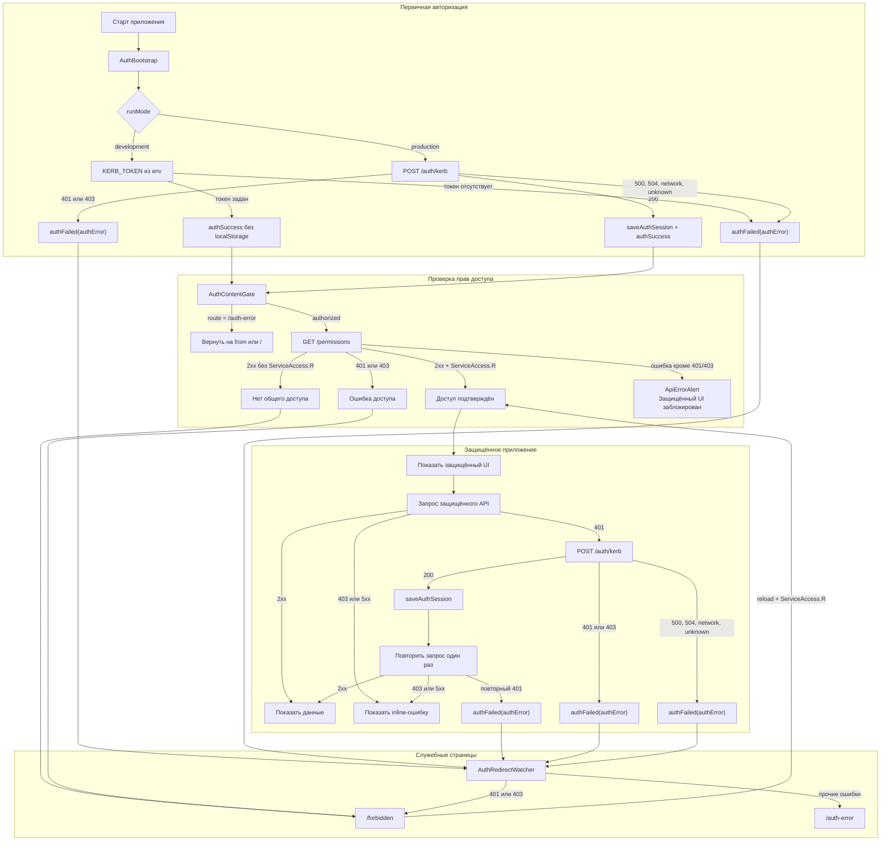

# Авторизация и права доступа

Документ описывает запуск авторизации, проверку общего доступа к сервису, обработку
ошибок permissions, повтор защищённых API-запросов после `401` и выбор служебных страниц.

[Вернуться в README](README.md)

## Краткий сценарий

1. `AuthBootstrap` выполняет первичную авторизацию:
   - в `development` использует `KERB_TOKEN` из окружения;
   - в `production` вызывает `POST /auth/kerb`.
2. `AuthContentGate` после успешной авторизации вызывает `GET /permissions`.
3. Пользователь получает доступ к защищённому UI только при наличии `ServiceAccess.R`.
4. Отсутствие права и итоговые `401`/`403` от permissions ведут на `/forbidden`.
5. Остальные ошибки permissions блокируют защищённый UI и отображаются через
   `ApiErrorAlert` без перехода на служебную страницу.
6. Ошибки авторизации ведут на `/auth-error`.
7. Защищённый API-запрос после `401` в `production` один раз обновляет сессию и
   повторяется.

Страница `/forbidden` восстанавливает доступ после reload: приложение повторно выполняет
авторизацию и проверку permissions. На маршруте `/auth-error` permissions не загружаются,
поскольку эта служебная страница относится только к ошибкам авторизации. Техническая
ошибка `GET /permissions` не изменяет успешное auth-состояние и не запускает редирект.

## Блок-схема

## Первичная авторизация

### Development

- `/auth/kerb` не вызывается;
- токен берётся из `KERB_TOKEN`;
- токен хранится только в Redux state и не записывается в `localStorage`;
- отсутствие токена считается ошибкой авторизации.

### Production

- `POST /auth/kerb` при `200` сохраняет токен в `localStorage` и Redux;
- `401` или `403` ведут на `/forbidden`;
- `500`, `504`, network и неизвестные ошибки ведут на `/auth-error`.

## Проверка permissions

`AuthContentGate` вызывает `GET /permissions`, когда авторизация завершена успешно и
текущий маршрут не равен `/auth-error`.

| Ответ `GET /permissions`       | Защищённая страница                 | `/forbidden`                           |
| ------------------------------ | ----------------------------------- | -------------------------------------- |
| `2xx` + есть `ServiceAccess.R` | показать защищённый UI              | перейти на `from` или `/`              |
| `2xx` без `ServiceAccess.R`    | перейти на `/forbidden`             | остаться на `/forbidden`               |
| итоговый `401` или `403`       | перейти на `/forbidden`             | остаться на `/forbidden`               |
| любая другая ошибка            | показать `ApiErrorAlert`, UI скрыть | показать `ApiErrorAlert` вместо экрана |

К техническим ошибкам permissions относятся, например, `404`, `500`, `504`, network и
неизвестные ошибки. Они не сбрасывают успешную Kerberos-авторизацию и не ведут ни на
`/auth-error`, ни на `/forbidden`.

`GET /permissions` выполняется через `createAuthBaseQuery`, поэтому первичный `401` в
`production` сначала запускает обновление Kerberos-сессии и однократный повтор запроса.
Таблица описывает итоговый ответ после этого механизма.

`ServiceAccessGate` дополнительно не монтирует основной shell приложения без
`ServiceAccess.R`.

## Повтор API-запроса после 401

Обычные API-запросы выполняются через `createAuthBaseQuery`. Если защищённый endpoint в
`production` возвращает `401`, приложение:

1. вызывает `POST /auth/kerb` напрямую через `fetch`;
2. сохраняет обновлённую сессию;
3. повторяет исходный запрос один раз.

Параллельные ответы `401` используют общий `authResultPromise`. Повторный `401` завершает
авторизацию ошибкой. Ответ `403` и серверные ошибки обычного API не запускают обновление
сессии и обрабатываются как ошибки конкретного запроса. В `development` retry не
выполняется.

## Служебные страницы

- `/forbidden` — отсутствует право `ServiceAccess.R` либо получен `401`/`403`;
- `/auth-error` — авторизацию не удалось выполнить или обновить из-за серверной, сетевой
  или неизвестной ошибки.

Обе страницы сохраняют основной header, скрывают sidebar и footer и предлагают
перезагрузить страницу. Техническая ошибка permissions не является служебной страницей:
`AuthContentGate` показывает стандартный alert, оставляя защищённый UI заблокированным.

## Размещение по слоям

- [`src/shared/auth`](../src/shared/auth) — auth-сессия, токен, Redux slice и selectors;
- [`src/shared/api`](../src/shared/api) — `mainApi`, `createAuthBaseQuery` и API routes;
- [`src/shared/routing`](../src/shared/routing) — безопасный `from` и служебные маршруты;
- [`src/entities/permission`](../src/entities/permission) — контракт ACL и
  `GET /permissions`;
- [`src/features/auth`](../src/features/auth) — bootstrap, gate, redirect watcher и auth UI;
- [`src/features/permissions`](../src/features/permissions) — проверка прав в UI.

Auth находится в `shared`, потому что управляет инфраструктурой токена и сессии.
Permissions находятся в `entities`, потому что ACL и ресурсы прав являются доменным
контрактом приложения.

## Правила для разработчиков

- Не монтировать защищённый UI до завершения auth и permissions.
- Новый общий ресурс права добавлять в `PERMISSION_RESOURCES`.
- Отсутствие необходимого права направлять на `/forbidden`.
- Ошибки авторизации направлять на `/auth-error`.
- `401`/`403` permissions направлять на `/forbidden`.
- Остальные ошибки permissions показывать через `ApiErrorAlert`, не меняя auth-состояние
  и не выполняя редирект.
- Ошибки обычных `GET`-запросов показывать inline в соответствующем виджете.
- Ошибки мутаций показывать как feedback на действие пользователя.
