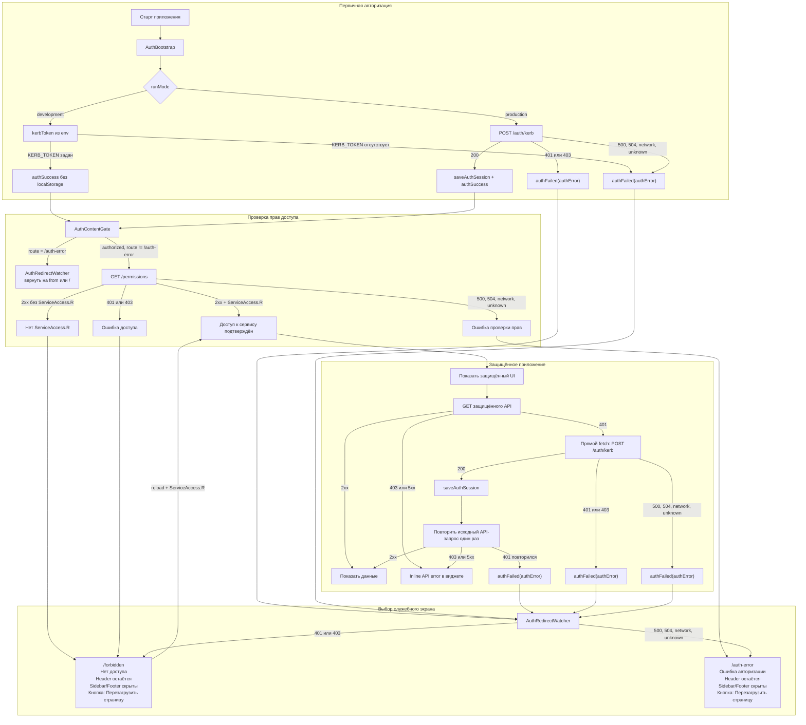

# Auth Flow

## Коротко

При старте приложения фронт сначала подтверждает пользователя, затем проверяет общий доступ к сервису.

1. `AuthBootstrap` выполняет первичную авторизацию:
   - `development` — берёт `KERB_TOKEN` из env;
   - `production` — вызывает `POST /auth/kerb`.
2. После успешной авторизации `AuthContentGate` вызывает `GET /permissions`.
3. Если в ACL есть `ServiceAccess.R`, монтируется защищённый UI.
4. Если общего доступа нет, пользователь попадает на `/forbidden`.
5. Если auth/permissions не удалось проверить из-за серверной или сетевой ошибки, пользователь попадает на `/auth-error`.

`/forbidden` умеет восстанавливаться: после reload снова выполняются `POST /auth/kerb` и `GET /permissions`. Если право вернулось, пользователь уходит на безопасный `from` или `/`.

`/auth-error` permissions не грузит: этот экран означает, что сама авторизация не подтверждена или не проверена.

## Блок-схема

Схема состоит из четырёх зон:

- `Первичная авторизация` — получает или обновляет auth token.
- `Проверка прав доступа` — подтверждает `ServiceAccess.R`.
- `Защищённое приложение` — обычные API-запросы и одноразовый retry после `401`.
- `Выбор служебного экрана` — финальные переходы на `/forbidden` и `/auth-error`.

## Детали

### FSD

- `src/shared/auth` — auth-сессия: `POST /auth/kerb`, token/session helpers, Redux slice, selectors.
- `src/shared/api` — `mainApi`, `createAuthBaseQuery`, API routes.
- `src/shared/routing` — helpers для `/forbidden`, `/auth-error` и безопасного `from`.
- `src/entities/permission` — контракт прав: constants, types, `GET /permissions`, `hasPermission`.
- `src/features/auth` — bootstrap, content gate, redirect watcher, auth status UI.
- `src/features/permissions` — gates для проверки прав в UI.

Auth лежит в `shared/auth`, потому что это инфраструктура токена и сессии. Permissions лежат в `entities/permission`, потому что ACL и ресурсы прав — доменный контракт приложения.

### Первичная Авторизация

В `development`:

- `/auth/kerb` не вызывается;
- token берётся из `KERB_TOKEN`;
- token хранится только в Redux state и не пишется в `localStorage`.

В `production`:

- `POST /auth/kerb` при `200` сохраняет token в `localStorage` и Redux;
- `401` или `403` ведут на `/forbidden`;
- `500`, `504`, network и unknown ведут на `/auth-error`.

### Permissions

`AuthContentGate` вызывает `GET /permissions`, если auth завершён успешно и текущий route не `/auth-error`.

| Ответ `GET /permissions`       | Защищённая страница      | `/forbidden`              |
| ------------------------------ | ------------------------ | ------------------------- |
| `2xx` + есть `ServiceAccess.R` | показать защищённый UI   | перейти на `from` или `/` |
| `2xx` + нет `ServiceAccess.R`  | перейти на `/forbidden`  | остаться на `/forbidden`  |
| `401` или `403`                | перейти на `/forbidden`  | остаться на `/forbidden`  |
| `500`, `504`, network, unknown | перейти на `/auth-error` | перейти на `/auth-error`  |

`ServiceAccessGate` дополнительно скрывает основной shell приложения без `ServiceAccess.R`.

### API 401 Retry

Обычные API-запросы идут через `createAuthBaseQuery`.

Если защищённый API возвращает `401` в `production`, фронт один раз вызывает `POST /auth/kerb` напрямую через `fetch`, сохраняет новый token и повторяет исходный запрос.

- Параллельные `401` используют один общий `authResultPromise`.
- Повтор исходного запроса выполняется только один раз.
- Повторный `401` завершает auth ошибкой.
- `403` от обычного API не запускает retry и считается ошибкой конкретного запроса.
- В `development` retry не выполняется.

### Служебные Страницы

`/forbidden` используется для ошибок доступа: `401`, `403`, отсутствие `ServiceAccess.R`.

`/auth-error` используется для ошибок проверки: `500`, `504`, network, unknown.

Обе страницы показываются без sidebar/footer, но с основным header и кнопкой `Перезагрузить страницу`.

### Правила Для Разработчиков

- Не монтировать защищённый UI до завершения auth и permissions.
- Новый общий ресурс права добавлять в `PERMISSION_RESOURCES`.
- Отсутствие нужного права вести на `/forbidden`.
- Ошибки проверки auth/permissions вести на `/auth-error`.
- Ошибки обычных `GET`-запросов показывать inline в виджете.
- Ошибки мутаций показывать как feedback на действие пользователя.
